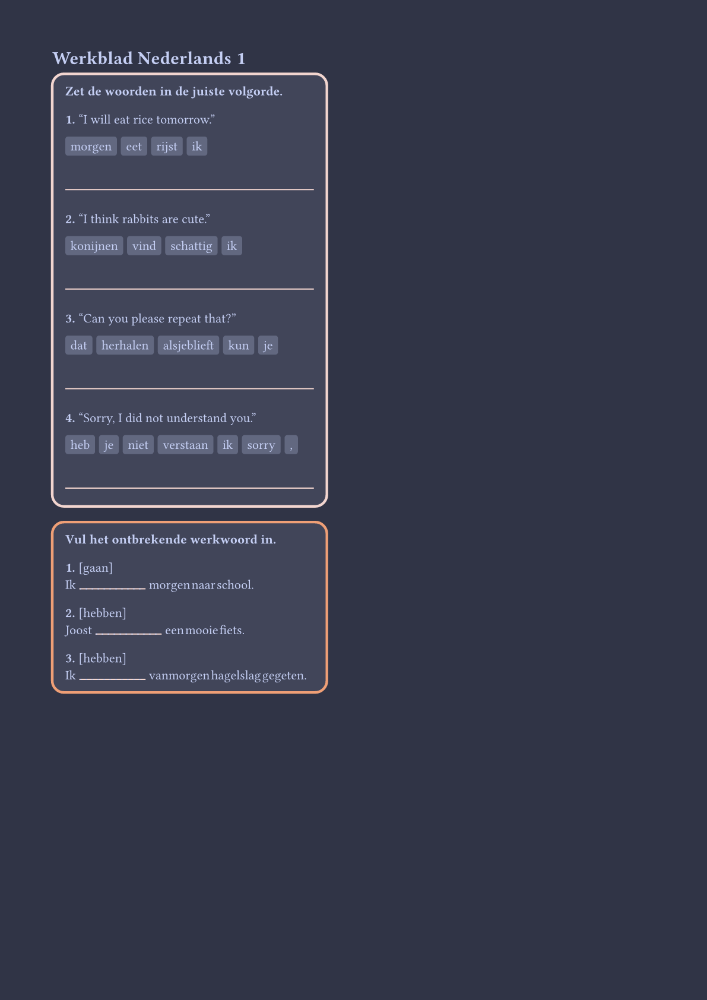

# Typst worksheet
Generate worksheets for language teaching.

Features:

- Word order (Ex. `ate cake the I`)
- Conjugation exercises (Ex.: `I ... the cake (to eat)`)
- Conjugation tables

Planned:

- Internationalized exercise descriptions
- Word lists

To use, clone this repo and run `just publish-local` (linux only).
Afterwards, you can import it under `@local/language_worksheet:0.0.1`
