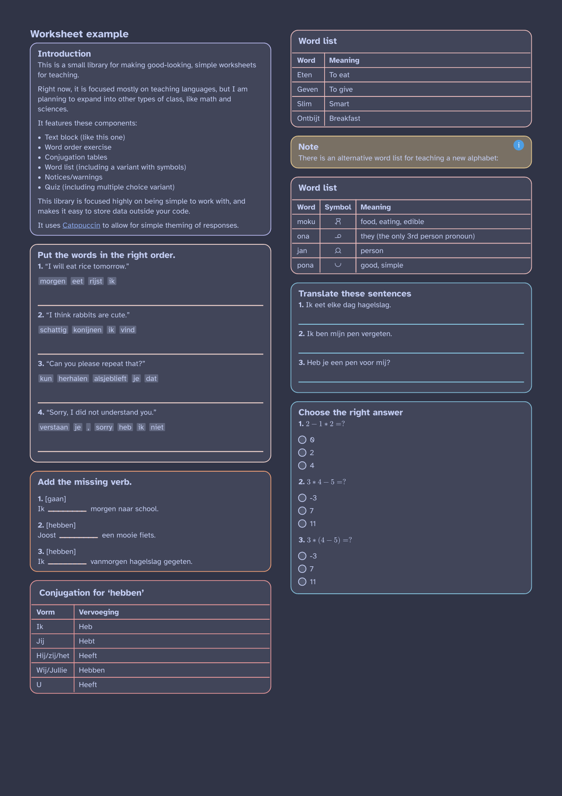

# Typst worksheet
Generate worksheets for language teaching.

Features:

- Word order (Ex. `ate cake the I`)
- Conjugation exercises (Ex.: `I ... the cake (to eat)`)
- Conjugation tables
- Word lists
- Story block

Planned:

- Automatic exercise numbering
- Internationalized exercise descriptions (will use [Linguify](https://typst.app/universe/package/linguify/))
- Fix rough edges on broken/interrupted word lists
- Writing exercises
- Direct translation exercises

To use, clone this repo and run `just publish-local`.
Afterwards, you can import it under `@local/language_worksheet:0.0.1`
